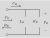

## derivation of lip radiation equations

### Ishizaka-Flanagan LR model [1, pp.1242-3]

"A radiation load equal to that for a circular piston in an infinite baffle"

Equivalent LR circuit models:

$$
\begin{align*}
L_R &= \frac{8}{3\pi c} \frac{\rho c}{\sqrt{\pi A_n}} = \tilde{L}_R \frac{\rho c}{A_n}\\
R_R &= \frac{128}{9\pi^2} \frac{\rho c}{A_n} = \tilde{R}_R \frac{\rho c}{A_n}\\
Z_R &= \frac{sL_R R_R}{R_R + sL_R} = \frac{\rho c}{A_n} \frac{s\tilde{L}_R \tilde{R}_R}{\tilde{R}_R + s\tilde{L}_R }\\
\tilde{Z}_R &= \frac{s\tilde{L}_R \tilde{R}_R}{\tilde{R}_R + s\tilde{L}_R }\\
\end{align*}
$$

$$
\begin{align*}
P_R &= F_R + B_R\\
U_R = P_R Z_R &= \frac{A_n}{\rho c} (F_R - B_R)\\
P_R \tilde{Z}_R &= F_R - B_R\\
\end{align*}
$$

$$
\begin{align*}
P_R &= \frac{2}{\tilde{Z}_R + 1} F_R \\
B_R &= P_R - F_R = \left(\frac{\tilde{Z}_R - 1}{\tilde{Z}_R + 1} \right)F_R \\\\
\end{align*}
$$

$$
H(s) = \frac{2}{\tilde{Z}_R + 1} = \frac{2 \tilde{R}_R + 2 \tilde{L}_R s}{\tilde{R}_R + s\tilde{L}_R(1+ \tilde{R}_R)} = \frac{B_0 + B_1s}{A_0 + A_1s}
$$
where $B_0 = 2\tilde{R}_R$, $B_1 = 2\tilde{L}_R$, $A_0 = \tilde{R}_R$, and $A_1 = \tilde{L}_R(1+\tilde{R}_R)$.

Bilinear transform: $s = 2f_s (1-z^{-1}) / (1+z^{-1})$

$$
H(z) = \frac{(B_0 + 2f_sB_1) + (B_0 - 2f_s B_1) z^{-1}}{(A_0+2f_s A_1) + (A_0 - 2f_s A_1)z^{-1}}
$$

## reference
[1] K. Ishizaka and J. L. Flanagan, “Synthesis of voiced sounds from a two-mass model of the vocal cords,” The Bell System Technical Journal, vol. 51, no. 6, pp. 1233–1268, 1972, doi: 10.1002/j.1538-7305.1972.tb02651.x.
[2] J. L. Flanagan, Speech Analysis Synthesis and Perception. Berlin, Heidelberg: Springer Berlin Heidelberg, 1972. doi: 10.1007/978-3-662-01562-9.

$$
P_{o,n} = (b_1 P_{o,n-1}  + (a_1-b_1) f_{n-1}  + (b_2+a_2) f_n )/b_2
$$  

$$
b_n = (b_1 b_{n-1} + a_1 f_{n-1} + a_2 f_n) / b_2
$$

### Story dissertation p64-70

$$
r_M = \frac{Z_{rad}-Z_M}{Z_{rad}+Z_M}
$$

$$
\begin{align}
Z_{rad}-Z_M &= (Z_{rad}^\prime -1) Z_M\\
Z_{rad}+Z_M &= (Z_{rad}^\prime +1) Z_M
\end{align}
$$

$$
\begin{align}
B_M &= r_M F_M\\
P_{rad} &= (1+r_M) F_M
\end{align}
$$

$$
Z_{rad} = \frac{sRL}{R+sL} = \frac{sR^\prime L^\prime}{R^\prime+sL^\prime}Z_M = Z_{rad}^\prime Z_M
$$
$$
Z_{M}= \frac{\rho c}{A_e}
$$

$$
r_M = \frac{Z_{rad}^\prime -1}{Z_{rad}^\prime +1}
$$

$$
\begin{align}
B_M &= \frac{Z_{rad}^\prime -1}{Z_{rad}^\prime +1} F_M\\
P_{rad} &= \frac{2 Z_{rad}^\prime }{Z_{rad}^\prime +1} F_M
\end{align}
$$
