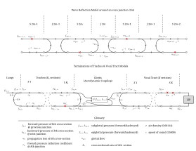

# Joining two-port subsystems of wave reflection model

Within a tube segment of wave reflection model, a number of subsystems may be
present in a model. For example, the boundary reflection subsystem plus a yielding 
wall subsystem. As the tube model gets more complex, deriving the system equations
quickly becomes cumbersome. A generalized approach is to express each subsystem
in a state-space representation and devise a way to connect two successive subsystems.

Suppose we have two subsystems with state-space models:

$$\begin{align}
\dot{\mathbf{s}}_1 &= \mathbf{A}_1 \mathbf{s}_1 + \mathbf{B}_1 \mathbf{x}_1 + \mathbf{B}_{\text{aux},1} \mathbf{x}_{\text{aux},1}\\
\mathbf{y}_1 &= \mathbf{C}_1 \mathbf{s}_1 + \mathbf{D}_1 \mathbf{x}_1 + \mathbf{D}_{\text{aux},1} \mathbf{x}_{\text{aux},1}\\
\dot{\mathbf{s}}_2 &= \mathbf{A}_2 \mathbf{s}_2 + \mathbf{B}_2 \mathbf{x}_2 + \mathbf{B}_{\text{aux},2} \mathbf{x}_{\text{aux},2}\\
\mathbf{y}_2 &= \mathbf{C}_2 \mathbf{s}_2 + \mathbf{D}_2 \mathbf{x}_2 + \mathbf{D}_{\text{aux},2} \mathbf{x}_{\text{aux},2}\\
\end{align}$$

where

$$
\mathbf{x}_1 = \begin{bmatrix}F_1\\B_2\end{bmatrix} \quad 
\mathbf{y}_1 = \begin{bmatrix}F_2\\B_1\end{bmatrix} \quad 
\mathbf{x}_2 = \begin{bmatrix}F_2\\B_3\end{bmatrix} \quad 
\mathbf{y}_2 = \begin{bmatrix}F_3\\B_2\end{bmatrix}
$$

and the input and output of the joined system is

$$
\mathbf{x} = \begin{bmatrix}F_1\\B_3\end{bmatrix} \quad 
\mathbf{x}_\text{aux} = \begin{bmatrix}\mathbf{x}_{\text{aux},1}\\\mathbf{x}_{\text{aux},2}\end{bmatrix} \quad 
\mathbf{y} = \begin{bmatrix}F_3\\B_1\end{bmatrix} \quad 
$$

  

What is a state-space represententation of the joined system $(\mathbf{A}, \mathbf{B}, \mathbf{C}, \mathbf{D})$ with state vector $\mathbf{s}\triangleq[\mathbf{s}_1\ \mathbf{s}_2]^T$?

Define picker matrices:

$$
\mathbf{U} = \begin{bmatrix}1&0\\0&0\end{bmatrix} \quad 
\mathbf{L} = \begin{bmatrix}0&0\\0&1\end{bmatrix} \quad 
$$

Then we can define the relationships of the input and output vectors as

$$\begin{align}
\mathbf{x}_1 &= \mathbf{L}\mathbf{y}_2 + \mathbf{U}\mathbf{x}\\
\mathbf{x}_2 &= \mathbf{U}\mathbf{y}_1 + \mathbf{L}\mathbf{x}\\
\mathbf{y} &= \mathbf{U}\mathbf{y}_2 + \mathbf{L}\mathbf{y}_1\\
\end{align}$$

Substitute (5) and (6) into (2) and (4), respectively:

$$\begin{align}
\mathbf{y}_1 &= \mathbf{C}_1 \mathbf{s}_1 + \mathbf{D}_1 \left(\mathbf{L}\mathbf{y}_2 + \mathbf{U}\mathbf{x}\right) + \mathbf{D}_{\text{aux},1} \mathbf{x}_{\text{aux},1} = \mathbf{C}_1 \mathbf{s}_1 + \mathbf{D}_1\mathbf{L}\mathbf{y}_2 + \mathbf{D}_1\mathbf{U}\mathbf{x} + \mathbf{D}_{\text{aux},1} \mathbf{x}_{\text{aux},1}\\\\
\mathbf{y}_2 &= \mathbf{C}_2 \mathbf{s}_2 + \mathbf{D}_2 \left(\mathbf{U}\mathbf{y}_1 + \mathbf{L}\mathbf{x}\right) + \mathbf{D}_{\text{aux},2} \mathbf{x}_{\text{aux},2} = \mathbf{C}_2 \mathbf{s}_2 + \mathbf{D}_2\mathbf{U}\mathbf{y}_1 + \mathbf{D}_2\mathbf{L}\mathbf{x}+ \mathbf{D}_{\text{aux},2} \mathbf{x}_{\text{aux},2}\\\\
\end{align}$$

Cross-substitute (10) and (11):

$$\begin{align}
\mathbf{y}_1 &= \mathbf{C}_1 \mathbf{s}_1 + \mathbf{D}_1\mathbf{L}\left(\mathbf{C}_2 \mathbf{s}_2 + \mathbf{D}_2\mathbf{U}\mathbf{y}_1 + \mathbf{D}_2\mathbf{L}\mathbf{x} + \mathbf{D}_{\text{aux},1} \mathbf{x}_{\text{aux},2}\right) + \mathbf{D}_1\mathbf{U}\mathbf{x} + \mathbf{D}_{\text{aux},1} \mathbf{x}_{\text{aux},1}\\
\mathbf{y}_2 &= \mathbf{C}_2 \mathbf{s}_2 + \mathbf{D}_2\mathbf{U}\left(\mathbf{C}_1 \mathbf{s}_1 + \mathbf{D}_1\mathbf{L}\mathbf{y}_2 + \mathbf{D}_1\mathbf{U}\mathbf{x} + \mathbf{D}_{\text{aux},1} \mathbf{x}_{\text{aux},1}\right) + \mathbf{D}_2\mathbf{L}\mathbf{x} + \mathbf{D}_{\text{aux},2} \mathbf{x}_{\text{aux},2}\\
\end{align}$$

Solve for $\mathbf{y}_1$ and $\mathbf{y}_2$:

$$\begin{align}
(\mathbf{I} - \mathbf{D}_1\mathbf{L}\mathbf{D}_2\mathbf{U})\mathbf{y}_1 &= \mathbf{C}_1 \mathbf{s}_1 + \mathbf{D}_1\mathbf{L}\mathbf{C}_2\mathbf{s}_2 + \mathbf{D}_1(\mathbf{L}\mathbf{D}_2\mathbf{L} + \mathbf{U})\mathbf{x}+ \mathbf{D}_{\text{aux},1} \mathbf{x}_{\text{aux},1} + \mathbf{D}_1\mathbf{L}\mathbf{D}_{\text{aux},2} \mathbf{x}_{\text{aux},2}\\
(\mathbf{I} - \mathbf{D}_2\mathbf{U}\mathbf{D}_1\mathbf{L})\mathbf{y}_2&= \mathbf{C}_2 \mathbf{s}_2 + \mathbf{D}_2\mathbf{U}\mathbf{C}_1\mathbf{s}_1 + \mathbf{D}_2(\mathbf{U}\mathbf{D}_1\mathbf{U} + \mathbf{L})\mathbf{x} + \mathbf{D}_2\mathbf{U}\mathbf{D}_{\text{aux},1} \mathbf{x}_{\text{aux},1} + \mathbf{D}_{\text{aux},2} \mathbf{x}_{\text{aux},2}\\
\end{align}$$

Let

$$\begin{align}
\mathbf{Q}_1 &\triangleq \mathbf{I} - \mathbf{D}_1\mathbf{L}\mathbf{D}_2\mathbf{U}\\
\mathbf{Q}_2 &\triangleq \mathbf{I} - \mathbf{D}_2\mathbf{U}\mathbf{D}_1\mathbf{L}\\
\mathbf{P}_1 &\triangleq \mathbf{D}_1(\mathbf{L}\mathbf{D}_2\mathbf{L} + \mathbf{U})\\
\mathbf{P}_2 &\triangleq \mathbf{D}_2(\mathbf{U}\mathbf{D}_1\mathbf{U} + \mathbf{L})\\
\end{align}$$

Then, we have

$$\begin{align}
\mathbf{y}_1 &= \mathbf{Q}_1^{-1}(\mathbf{C}_1 \mathbf{s}_1 + \mathbf{D}_1\mathbf{L}\mathbf{C}_2\mathbf{s}_2 + \mathbf{P}_1\mathbf{x}+ \mathbf{D}_{\text{aux},1} \mathbf{x}_{\text{aux},1} + \mathbf{D}_1\mathbf{L}\mathbf{D}_{\text{aux},2} \mathbf{x}_{\text{aux},2})\\
\mathbf{y}_2&= \mathbf{Q}_2^{-1}(\mathbf{C}_2 \mathbf{s}_2 + \mathbf{D}_2\mathbf{U}\mathbf{C}_1\mathbf{s}_1 + \mathbf{P}_2\mathbf{x} + \mathbf{D}_2\mathbf{U}\mathbf{D}_{\text{aux},1} \mathbf{x}_{\text{aux},1} + \mathbf{D}_{\text{aux},2} \mathbf{x}_{\text{aux},2})\\
\end{align}$$

The joined output equation is found by substituting (18) and (19) into (7):

$$\begin{aligned}
\mathbf{y} &= \mathbf{U}\mathbf{Q}_2^{-1}\left[\mathbf{C}_2 \mathbf{s}_2 + \mathbf{D}_2\mathbf{U}\mathbf{C}_1\mathbf{s}_1 + \mathbf{P}_2\mathbf{x} + \mathbf{D}_{\text{aux},2} \mathbf{x}_{\text{aux},2}\right] + \mathbf{L}\mathbf{Q}_1^{-1}\left[\mathbf{C}_1 \mathbf{s}_1 + \mathbf{D}_1\mathbf{L}\mathbf{C}_2\mathbf{s}_2 + \mathbf{P}_1\mathbf{x} + \mathbf{D}_{\text{aux},1} \mathbf{x}_{\text{aux},1}\right]\\
&= 
(\mathbf{U}\mathbf{Q}_2^{-1}\mathbf{D}_2\mathbf{U} 
+ \mathbf{L}\mathbf{Q}_1^{-1}) \mathbf{C}_1\mathbf{s}_1 
+ (\mathbf{U}\mathbf{Q}_2^{-1}
+ \mathbf{L}\mathbf{Q}_1^{-1}\mathbf{D}_1\mathbf{L})\mathbf{C}_2\mathbf{s}_2 
+ (\mathbf{U}\mathbf{Q}_2^{-1}\mathbf{P}_2
+ \mathbf{L}\mathbf{Q}_1^{-1}\mathbf{P}_1)\mathbf{x}
+ \mathbf{L}\mathbf{Q}_1^{-1}\mathbf{D}_{\text{aux},1} \mathbf{x}_{\text{aux},1} + \mathbf{U}\mathbf{Q}_2^{-1}\mathbf{D}_{\text{aux},2} \mathbf{x}_{\text{aux},2}\\
&= \mathbf{C} \mathbf{s} + \mathbf{D}\mathbf{x} + \mathbf{D}_{\text{aux}} \mathbf{x}_{\text{aux}}\\
\end{aligned}$$

with

$$\begin{align}
\mathbf{C} &=
\begin{bmatrix}
(\mathbf{L}\mathbf{Q}_1^{-1}  + 
\mathbf{U}\mathbf{Q}_2^{-1}\mathbf{D}_2\mathbf{U})\mathbf{C}_1
&
(\mathbf{U}\mathbf{Q}_2^{-1}  + 
\mathbf{L}\mathbf{Q}_1^{-1}\mathbf{D}_1\mathbf{L})\mathbf{C}_2
\end{bmatrix}\\
\mathbf{D} &= \mathbf{U}\mathbf{Q}_2^{-1}\mathbf{P}_2 + \mathbf{L}\mathbf{Q}_1^{-1}\mathbf{P}_1\\
\mathbf{D}_\text{aux} &=
\begin{bmatrix}
(\mathbf{L}\mathbf{Q}_1^{-1}  + 
\mathbf{U}\mathbf{Q}_2^{-1}\mathbf{D}_2\mathbf{U})\mathbf{D}_{\text{aux},1}
&
(\mathbf{U}\mathbf{Q}_2^{-1}  + 
\mathbf{L}\mathbf{Q}_1^{-1}\mathbf{D}_1\mathbf{L})\mathbf{D}_{\text{aux},2}
\end{bmatrix}\\
\end{align}
$$

The derivation of the state update equation follows the same, starting with sustituting (5) and (6) into (1) and (3):

$$\begin{align}
\dot{\mathbf{s}}_1 &= \mathbf{A}_1 \mathbf{s}_1 + \mathbf{B}_1 \left(\mathbf{L}\mathbf{y}_2 + \mathbf{U}\mathbf{x}\right) + \mathbf{B}_{\text{aux},1}\mathbf{x}_{\text{aux},1}
= \mathbf{A}_1 \mathbf{s}_1 + \mathbf{B}_1\mathbf{L}\mathbf{y}_2 + \mathbf{B}_1\mathbf{U}\mathbf{x} + \mathbf{B}_{\text{aux},1}\mathbf{x}_{\text{aux},1}\\
\dot{\mathbf{s}}_2 &= \mathbf{A}_2 \mathbf{s}_2 + \mathbf{B}_2 \left(\mathbf{U}\mathbf{y}_1 + \mathbf{L}\mathbf{x}\right) + \mathbf{B}_{\text{aux},2}\mathbf{x}_{\text{aux},2} 
= \mathbf{A}_2 \mathbf{s}_2 + \mathbf{B}_2\mathbf{U}\mathbf{y}_1 + \mathbf{B}_2\mathbf{L}\mathbf{x} + \mathbf{B}_{\text{aux},2}\mathbf{x}_{\text{aux},2}\\
\end{align}$$

Substitute (18) and (19) into (24) and (25):

$$\begin{align}
\dot{\mathbf{s}}_1 &= \mathbf{A}_1 \mathbf{s}_1 + \mathbf{B}_1\mathbf{L}\left(\mathbf{Q}_2^{-1}(\mathbf{C}_2 \mathbf{s}_2 + \mathbf{D}_2\mathbf{U}\mathbf{C}_1\mathbf{s}_1 + \mathbf{P}_2\mathbf{x})\right) + \mathbf{B}_1\mathbf{U}\mathbf{x} + \mathbf{B}_{\text{aux},1}\mathbf{x}_{\text{aux},1}\\
\dot{\mathbf{s}}_2 &= \mathbf{A}_2 \mathbf{s}_2 + \mathbf{B}_2\mathbf{U}\left(\mathbf{Q}_1^{-1}(\mathbf{C}_1 \mathbf{s}_1 + \mathbf{D}_1\mathbf{L}\mathbf{C}_2\mathbf{s}_2 + \mathbf{P}_1\mathbf{x})\right) + \mathbf{B}_2\mathbf{L}\mathbf{x} + \mathbf{B}_{\text{aux},2}\mathbf{x}_{\text{aux},2}\\
\end{align}$$

Algebraic simplification leads to

$$\begin{align}
\dot{\mathbf{s}}_1 &= (\mathbf{A}_1 + \mathbf{B}_1\mathbf{L}\mathbf{Q}_2^{-1}\mathbf{D}_2\mathbf{U}\mathbf{C}_1)\mathbf{s}_1 + \mathbf{B}_1\mathbf{L}\mathbf{Q}_2^{-1}\mathbf{C}_2 \mathbf{s}_2 + \mathbf{B}_1\mathbf{L}(\mathbf{Q}_2^{-1}\mathbf{P}_2 + \mathbf{B}_1\mathbf{U})\mathbf{x} + \mathbf{B}_{\text{aux},1}\mathbf{x}_{\text{aux},1}\\
\dot{\mathbf{s}}_2 &= \mathbf{B}_2\mathbf{U}\mathbf{Q}_1^{-1}\mathbf{C}_1 \mathbf{s}_1 + (\mathbf{A}_2 + \mathbf{B}_2\mathbf{U}\mathbf{Q}_1^{-1}\mathbf{D}_1\mathbf{L}\mathbf{C}_2)\mathbf{s}_2 + \mathbf{B}_2\mathbf{U}(\mathbf{Q}_1^{-1}\mathbf{P}_1 + \mathbf{B}_2\mathbf{L})\mathbf{x} + \mathbf{B}_{\text{aux},2}\mathbf{x}_{\text{aux},2}\\
\end{align}$$

Combining the states to be $\mathbf{s} = [\mathbf{s}_1^T\ \mathbf{s}_2^T]^T$ we get

$$
\dot{\mathbf{s}} = \mathbf{A}\mathbf{s} + \mathbf{B}\mathbf{x}  + \mathbf{B}_\text{aux}\mathbf{x}_\text{aux}
$$

where

$$\begin{align}
\mathbf{A} &= \begin{bmatrix}
\mathbf{A}_1 + \mathbf{B}_1\mathbf{L}\mathbf{Q}_2^{-1}\mathbf{D}_2\mathbf{U}\mathbf{C}_1
 & \mathbf{B}_1\mathbf{L}\mathbf{Q}_2^{-1}\mathbf{C}_2 \\
\mathbf{B}_2\mathbf{U}\mathbf{Q}_1^{-1}\mathbf{C}_1
 & \mathbf{A}_2 + \mathbf{B}_2\mathbf{U}\mathbf{Q}_1^{-1}\mathbf{D}_1\mathbf{L}\mathbf{C}_2\\
\end{bmatrix}\\
&= \begin{bmatrix}\mathbf{A}_1 & \mathbf{0}\\\mathbf{0} & \mathbf{A}_2\end{bmatrix} + 
\begin{bmatrix}\mathbf{B}_1 & \mathbf{0}\\\mathbf{0} & \mathbf{B}_2\end{bmatrix}
\begin{bmatrix}
\mathbf{L}\mathbf{Q}_2^{-1}\mathbf{D}_2\mathbf{U}
 & \mathbf{L}\mathbf{Q}_2^{-1}\\
\mathbf{U}\mathbf{Q}_1^{-1}
 & \mathbf{U}\mathbf{Q}_1^{-1}\mathbf{D}_1\mathbf{L}\\
\end{bmatrix}
\begin{bmatrix}\mathbf{C}_1 & \mathbf{0}\\\mathbf{0} & \mathbf{C}_2\end{bmatrix}
\\
\mathbf{B} &= \begin{bmatrix}
\mathbf{B}_1(\mathbf{L}\mathbf{Q}_2^{-1}\mathbf{P}_2 + \mathbf{U})\\
\mathbf{B}_2(\mathbf{U}\mathbf{Q}_1^{-1}\mathbf{P}_1 + \mathbf{L})
\end{bmatrix}\\
\mathbf{B}_\text{aux} &=\begin{bmatrix}
\mathbf{B}_{\text{aux},1} & \mathbf{0}\\
\mathbf{0} & \mathbf{B}_{\text{aux},2}
\end{bmatrix}
\end{align}$$

The overall $\mathbf{A}$, $\mathbf{B}$, $\mathbf{C}$, and $\mathbf{D}$ matrices often
contains $\mathbf{L}\mathbf{Q}_2^{-1}$ and $\mathbf{U}\mathbf{Q}_1^{-1}$. These evalute
to

$$\begin{aligned}
\mathbf{L}\mathbf{Q}_2^{-1} = \gamma^{-1} \mathbf{L}\\
\mathbf{U}\mathbf{Q}_1^{-1} = \gamma^{-1} \mathbf{U}
\end{aligned}$$

where

$$
\gamma \triangleq 1 - d_{1,12}d_{2,21}
$$

Additional algebraic manipulations yield the following final expressions:

$$\begin{align}
\mathbf{A} &= 
\begin{bmatrix}
\mathbf{A}_1 & \mathbf{0}\\
\mathbf{0} & \mathbf{A}_2 \\
\end{bmatrix} + 
\frac{1}{\gamma}
\begin{bmatrix}
\mathbf{b}_{1,2}d_{2,21}\mathbf{c}_{1,1} & 
\mathbf{b}_{1,2}\mathbf{c}_{2,2}\\
\mathbf{b}_{2,1}\mathbf{c}_{1,1} &
\mathbf{b}_{2,1}d_{1,12}\mathbf{c}_{2,2} \\
\end{bmatrix}\\
\mathbf{B} &= 
\frac{1}{\gamma}
\begin{bmatrix}
\mathbf{B}_1 & \mathbf{0}\\
\mathbf{0} & \mathbf{B}_2 \\
\end{bmatrix}
\begin{bmatrix}
\gamma & 0\\
d_{1,11}d_{2,21} & d_{2,22}\\
d_{1,11} & d_{1,12}d_{2,22}\\
0 & \gamma
\end{bmatrix}\\
\mathbf{B}_\text{aux} &=\begin{bmatrix}
\mathbf{B}_{\text{aux},1} & \mathbf{0}\\
\mathbf{0} & \mathbf{B}_{\text{aux},2}
\end{bmatrix}\\
\mathbf{C} &= \frac{1}{\gamma}
\begin{bmatrix}
d_{2,11}         &      0 & \gamma & d_{1,12}d_{2,11} \\
d_{1,22}d_{2,21} & \gamma &      0 & d_{1,22}\\
\end{bmatrix}
\begin{bmatrix}
\mathbf{C}_1 &\mathbf{0}\\
\mathbf{0} & \mathbf{C}_2
\end{bmatrix}\\
\mathbf{D} &= 
\frac{1}{\gamma}
\begin{bmatrix}
d_{2,11} & 0 \\
0 & d_{1,22}
\end{bmatrix}\begin{bmatrix}
1 & d_{1,12} \\
d_{2,21} & 1
\end{bmatrix}
\begin{bmatrix}
d_{1,11} & 0 \\
0 & d_{2,22}
\end{bmatrix}+
\begin{bmatrix}
0 & d_{2,12} \\
d_{1,21} & 0
\end{bmatrix}\\
\mathbf{D}_\text{aux} &= \frac{1}{\gamma}
\begin{bmatrix}
d_{2,11}         &      0 & \gamma & d_{1,12}d_{2,11} \\
d_{1,22}d_{2,21} & \gamma &      0 & d_{1,22}\\
\end{bmatrix}
\begin{bmatrix}
\mathbf{D}_{\text{aux},1} & \mathbf{0}\\
\mathbf{0} & \mathbf{D}_{\text{aux},2}
\end{bmatrix}\\
\end{align}$$

# State-space representation of a lossless tube junction

A lossless tube junction from a tube with cross-sctional area $A_1$ to $A_2$ could have two additional inputs: the kinetic pressure drop $P_e$ and fricative noise flow $U_n$.

This system obeys the law of pressure and flow conservations:
$$\begin{align}
F_1+B_1 + P_e = F_2 + B_2\\
\frac{1}{Z_1}(F_1-B_1) + U_n = \frac{1}{Z_2}(F_2-B_2)
\end{align}$$

where

$$\begin{align}
Z_1 &\triangleq \frac{\rho c}{A_1}\\
Z_2 &\triangleq \frac{\rho c}{A_2}\\
\end{align}$$

are the acoustic impedance of each tube sections.

Solve (28) and (29) for $F_1$ and $B_2$:

$$\begin{aligned}
\begin{bmatrix}
1 & -1\\
Z_2^{-1} & Z_1^{-1}
\end{bmatrix}
\begin{bmatrix}F_2\\B_1\end{bmatrix}
&= 
\begin{bmatrix}
1 & -1\\
Z_1^{-1} & Z_2^{-1}
\end{bmatrix}
\begin{bmatrix}F_1\\B_2\end{bmatrix}
+\begin{bmatrix}
-1 & 0\\
0 & 1
\end{bmatrix}
\begin{bmatrix}P_e\\U_n\end{bmatrix}\\
\begin{bmatrix}F_2\\B_1\end{bmatrix}
&= 
\begin{bmatrix}
Z_1^{-1} & 1\\
-Z_2^{-1} & 1
\end{bmatrix}
\left(
\begin{bmatrix}
1 & -1\\
Z_1^{-1} & Z_2^{-1}
\end{bmatrix}
\begin{bmatrix}F_1\\B_2\end{bmatrix}
\begin{bmatrix}
-1 & 0\\
0 & 1
\end{bmatrix}
\begin{bmatrix}P_e\\U_n\end{bmatrix}\right)\\
&= 
\frac{1}{Z_1^{-1}+Z_2^{-1}}
\begin{bmatrix}
2Z_1^{-1} & Z_2^{-1}-Z_1^{-1}\\
Z_1^{-1}-Z_2^{-1} & 2Z_2^{-1}
\end{bmatrix}
\begin{bmatrix}F_1\\B_2\end{bmatrix}
+\frac{1}{Z_1^{-1}+Z_2^{-1}}
\begin{bmatrix}
-Z_1^{-1} & 1\\
Z_2^{-1} & 1
\end{bmatrix}
\begin{bmatrix}P_e\\U_n\end{bmatrix}
\\
&= 
\frac{1}{Z_1+Z_2}
\begin{bmatrix}
2Z_2 & Z_1-Z_2\\
Z_2-Z_1 & 2Z_1
\end{bmatrix}\begin{bmatrix}F_1\\B_2\end{bmatrix}
+\frac{1}{Z_1+Z_2}
\begin{bmatrix}
-Z_2 & Z_1Z_2\\
Z_1 & Z_1Z_2
\end{bmatrix}\begin{bmatrix}P_e\\U_n\end{bmatrix}\\
&= 
\frac{1}{A_1+A_2}
\begin{bmatrix}
2A_1 & A_2-A_1\\
A_1-A_2 & 2A_2
\end{bmatrix}
\begin{bmatrix}F_1\\B_2\end{bmatrix}
+\frac{1}{A_1+A_2}
\begin{bmatrix}
-A_1 & \rho c\\
A_2 & \rho c
\end{bmatrix}
\begin{bmatrix}P_e\\U_n\end{bmatrix}
\end{aligned}$$

The two external inputs $P_e$ and $U_n$ are combined as an auxiliary input vector 
$\mathbf{x}_\text{aux} \triangleq \begin{bmatrix}P_e & U_n\end{bmatrix}^T$, 
and we have the $\mathbf{D}$ and $\mathbf{D}_\text{aux}$
matrices as

$$\begin{align}
\mathbf{D} &= 
\frac{1}{A_1+A_2}
\begin{bmatrix}
2A_1 & A_2-A_1\\
A_1-A_2 & 2A_2
\end{bmatrix} = 
\mathbf{I} + 
\frac{A_1-A_2}{A_1+A_2}
\begin{bmatrix}
1 & -1\\1 & -1
\end{bmatrix}\\
\mathbf{D}_\text{aux} &= 
\frac{1}{A_1+A_2}
\begin{bmatrix}
-A_1 & \rho c\\
 A_2 & \rho c
\end{bmatrix}\\
\end{align}$$

Both $\mathbf{A}$ and $\mathbf{B}$ matrices are "empty" as this block is stateless.

# State-space representation of a yielding wall block

The yielding wall is modeled by a series acoustic RLC network with the transfer function
$$
H_w(s) \triangleq \frac{U_w(s)}{P(s)} = \frac{C_w s}{L_w C_w s^2 + RC_w s + 1}
$$
where the total pressure seen by the wall is $P$ and $U_w$ is the flow 
yielding to the wall. Let $\mathbf{A}_w$, $\mathbf{b}_w$, $\mathbf{c}_w$, and $d_w$
as the state-space matrices of this transfer function. Note that this block 
represents any effect (or a combination thereof) of a flow into the wall
For example, inclusion of the heat conduction loss with a parallel admittance 
$G_t$ modifies the transfer function to
$$
H_w^\text{(+heat loss)}(s) \triangleq \frac{C_w s}{L_w C_w s^2 + RC_w s + 1} + G_t
$$

In terms of the partial pressures, we have
$$\begin{align}
F_1+B_1 &= F_2+B_2\\
\frac{1}{Z}(F_1-B_1) &= \frac{1}{Z}(F_2-B_2) + U_w
\end{align}$$
Here, the tube cross-sectional area is fixed so the impedance is a constant $Z$.
Substitute the state-space output equation $\mathbf{c}_w\mathbf{s}_w + d_w P$ as $U_w$:
$$\begin{align}
F_1+B_1 &= F_2+B_2\\
\frac{1}{Z}(F_1-B_1) &= \frac{1}{Z}(F_2-B_2) + \mathbf{c}_w\mathbf{s}_w + d_w (F_1+B_1)\\
\frac{1}{Z}F_2 + \left(\frac{1}{Z} + d_w\right)B_1 &= \left(\frac{1}{Z} - d_w\right)F_1 + \frac{1}{Z}B_2 - \mathbf{c}_w\mathbf{s}_w\\
\end{align}$$
Solve for $F_2$ and $B_1$ in a matrix-vector format:
$$\begin{aligned}
\begin{bmatrix}
1 & -1\\
Z^{-1} & Z^{-1} + d_w
\end{bmatrix}
\begin{bmatrix}F_2\\B_1\end{bmatrix}
&=
\begin{bmatrix}
1 & -1\\
Z^{-1} - d_w & Z^{-1}
\end{bmatrix}
\begin{bmatrix}F_1\\B_2\end{bmatrix}
+
\begin{bmatrix}
0\\
- \mathbf{c}_w
\end{bmatrix}\mathbf{s}_w\\
\begin{bmatrix}F_2\\B_1\end{bmatrix}
&=
\frac{1}{2Z^{-1} + d_w}
\begin{bmatrix}
Z^{-1} + d_w & 1\\
-Z^{-1} & 1
\end{bmatrix}
\left(
\begin{bmatrix}
Z^{-1} + d_w & 1\\
-Z^{-1} & 1
\end{bmatrix}
\begin{bmatrix}F_1\\B_2\end{bmatrix}
+
\begin{bmatrix}
0\\
- \mathbf{c}_w
\end{bmatrix}\mathbf{s}_w\right)\\
&=
\frac{1}{2Z^{-1} + d_w}\left(
\begin{bmatrix}
2 Z^{-1} & -d_w\\
-d_w & 2Z^{-1}
\end{bmatrix}
\begin{bmatrix}
F_1\\B_2
\end{bmatrix}
+
\begin{bmatrix}
- \mathbf{c}_w\\
- \mathbf{c}_w
\end{bmatrix}\mathbf{s}_w\right)\\
&=
\frac{1}{2A + \rho c d_w}\left(
\begin{bmatrix}
2A & -\rho cd_w\\
-\rho cd_w & 2A
\end{bmatrix}
\begin{bmatrix}
F_1\\B_2
\end{bmatrix}
+
\begin{bmatrix}
- \rho c \mathbf{c}_w\\
- \rho c \mathbf{c}_w
\end{bmatrix}\mathbf{s}_w\right)\\
\end{aligned}$$

Now, for the state update equation, use partial pressures as the input
$$
\dot{\mathbf{s}}_w = \mathbf{A}_w \mathbf{s}_w + \mathbf{b}_w(F_1+B_1)
$$
Substitute the output equation for $B_1$:
$$\begin{aligned}
\dot{\mathbf{s}}_w 
&= \mathbf{A}_w \mathbf{s}_w + \mathbf{b}_w\left[F_1+\frac{1}{2A + \rho c d_w}\left(
\begin{bmatrix}-\rho cd_w & 2A\end{bmatrix}
\begin{bmatrix}F_1\\B_2\end{bmatrix}
- \mathbf{c}_w \mathbf{s}_w\right)\right]\\
&= \mathbf{A}_w \mathbf{s}_w - \frac{\mathbf{b}_w\mathbf{c}_w}{2A + \rho c d_w} \mathbf{s}_w + \mathbf{b}_w\left(F_1-\frac{\rho cd_w}{2A + \rho c d_w} F_1 + \frac{2A}{2A + \rho c d_w} B_2 \right)\\
&= \left(\mathbf{A}_w - \frac{\mathbf{b}_w\mathbf{c}_w}{2A + \rho c d_w}\right) \mathbf{s}_w 
+ 
\frac{2A}{2A + \rho c d_w} \mathbf{b}_w
\begin{bmatrix}
1 & 1
\end{bmatrix}
\begin{bmatrix}
F_1\\B_2
\end{bmatrix}
\\
\end{aligned}$$

Hence, we have the yielding-wall block:
$$\begin{align}
\mathbf{A} &= \mathbf{A}_w - \frac{\mathbf{b}_w\mathbf{c}_w}{2A + \rho c d_w}\\
\mathbf{B} &= \frac{2A}{2A + \rho c d_w} \mathbf{b}_w
\begin{bmatrix}
1 & 1
\end{bmatrix}\\
\mathbf{C} &= \frac{-\rho c}{2A + \rho c d_w}\begin{bmatrix}1\\1\end{bmatrix}\mathbf{c}_w\\
\mathbf{D} &= \frac{1}{2A + \rho c d_w}
\begin{bmatrix}
2A & -\rho cd_w\\
-\rho cd_w & 2A
\end{bmatrix}
\end{align}$$

# Example: Pairing the tube junction and yielding wall
The state-space matrices of the two networks are:
$$\begin{align*}
\mathbf{C}_1 &= 
\frac{1}{A_1+A_2}
\begin{bmatrix}
-A_1 & -\rho c\\
 A_2 & -\rho c
\end{bmatrix}\\
\mathbf{D}_1 &= 
\frac{1}{A_1+A_2}
\begin{bmatrix}
2A_1 & A_2-A_1\\
A_1-A_2 & 2A_2
\end{bmatrix}\\
\mathbf{A}_2 &= \mathbf{A}_w - \frac{\mathbf{b}_w\mathbf{c}_w}{2A_2 + \rho c d_w}\\
\mathbf{B}_2 &= \frac{2A}{2A_2 + \rho c d_w} \mathbf{b}_w
\begin{bmatrix}
1 & 1
\end{bmatrix}\\
\mathbf{C}_2 &= \frac{-\rho c}{2A_2 + \rho c d_w}\begin{bmatrix}1\\1\end{bmatrix}\mathbf{c}_w \\
\mathbf{D}_2 &= \frac{1}{2A_2 + \rho c d_w}\begin{bmatrix}
2A_2 & -\rho cd_w\\
-\rho cd_w & 2A_2
\end{bmatrix}
\end{align*}$$

First, find the $\gamma$ expression:
$$\begin{aligned}
\gamma &= 1 - d_{1,12}d_{2,21} \\
&= 1 - \frac{A_2-A_1}{A_1+A_2}\times\frac{-\rho cd_w}{2A_2 + \rho c d_w}\\
&= 1 + \frac{\rho cd_w(A_2-A_1)}{(A_1+A_2)(2A_2 + \rho c d_w)}\\
&= \frac{2A_2(A_1 + A_2 + \rho c d_w)}{(A_1+A_2)(2A_2 + \rho c d_w)}\\
&\triangleq \frac{2A_2D}{D_1D_2}\\
\end{aligned}$$
Note that $D =A_1 + A_2 + \rho c d_w$ is the expected denominator expression of
the joined network (Story, 1995).

Now, substitute the elements for the joined $\mathbf{D}$ matrix:
$$\begin{aligned}
\mathbf{D} &= 
\frac{1}{\gamma}
\begin{bmatrix}d_{2,11} & 0 \\0 & d_{1,22}\end{bmatrix}
\begin{bmatrix}1 & d_{1,12} \\d_{2,21} & 1\end{bmatrix}
\begin{bmatrix}d_{1,11} & 0 \\0 & d_{2,22}\end{bmatrix}
+
\begin{bmatrix}0 & d_{2,12} \\d_{1,2/D_11} & 0\end{bmatrix}\\
&=\frac{1}{\gamma}
\begin{bmatrix}2A_2/D_2 & 0 \\0 & 2A_2\end{bmatrix}
\begin{bmatrix}1 & (A_2-A_1)/D_1 \\-\rho c d_w/D_2 & 1\end{bmatrix}
\begin{bmatrix}2A_1/D_1 & 0 \\0 & 2A_2/D_2\end{bmatrix}
+
\begin{bmatrix}0 & -\rho c d_w/D_2 \\(A_1-A_2)/D_1 & 0\end{bmatrix}\\
&=\frac{1}{D}
\begin{bmatrix}2A_1 & 2 A_2(A_2-A_1)/D_2\\
-2\rho c d_w A_1/D_1 & 2A_2
\end{bmatrix}
+
\begin{bmatrix}0 & -\rho c d_w/D_2 \\(A_1-A_2)/D_1 & 0\end{bmatrix}\\
&=\frac{1}{D}
\begin{bmatrix}2A_1 & A_2-A_1 - \rho c d_wD \\
A_1-A_2 - \rho c d_wD & 2A_2
\end{bmatrix}
\end{aligned}$$
This expression is equivalent to the ($B_2+\Psi$) term of (2.50) and the ($B_1+\Psi$) term of (2.51) in (Story, 1995).

Next, $\mathbf{C}$:
$$\begin{aligned}
\mathbf{C} &= \frac{1}{\gamma}
\begin{bmatrix}
\gamma & d_{1,12}d_{2,11} \\
     0 & d_{1,22}\\
\end{bmatrix}
\mathbf{C}_2\\
&= \frac{D_1D_2}{2A_2 D}
\begin{bmatrix}
2A_2D/(D_1D_2) & (A_2-A_1)/D_1 \times 2A_2/D_2 \\
0 & 2A_2/D_1\\
\end{bmatrix}\times
\left(-\rho c\mathbf{1}\mathbf{c_w}/D_1\right)\\
&= -\frac{\rho c}{D}\frac{D_2}{D_1}\mathbf{1}\mathbf{c_w}\\
&= -\frac{\rho c}{D}\frac{2A_2 + \rho c d_w}{A_1+A_2}\mathbf{1} \mathbf{c_w}\\
\end{aligned}$$
This term differs from (Story 1995), which was given by $-\beta \rho c/D $. The 
$\beta$ term actually corresponds to $\mathbf{c}_w \mathbf{s}_2$. The extra
adjustment term $D_2/D_1$ emerges from the coupling between $P_2$ and $U_w$, i.e., 
both $P_2$ and $U_w$ contain both the input and output partial pressures. The effect
of this coupling is the $D_2/D_1$ term, suggesting that if the vocal tract widens
from Tube 1 to Tube 2, the amount of flow exchange with the wall increases in Tube 2.

Finally, here are the state update matrices:

$$\begin{aligned}
\mathbf{A} &= \mathbf{A}_2  + 
\frac{d_{1,12}}{\gamma}\mathbf{b}_{2,1}\mathbf{c}_{2,2} \\
&= \mathbf{A}_w  + \left[\mathbf{b}_w\frac{2A_2}{D_2}\right]\left[\frac{A_2-A_1}{D_1}\right]
\left[\frac{D_1D_2}{2A_2D}\right]\left[-\frac{1}{D_2}\mathbf{c}_w\right] \\
&= \mathbf{A}_w  + \mathbf{b}_w\frac{1}{D}\frac{A_1-A_2}{D_2}\mathbf{c}_w \\
\mathbf{B} &= \frac{1}{\gamma}\mathbf{B}_2
\begin{bmatrix}d_{1,11} & d_{1,12}d_{2,22}\\0 & \gamma\end{bmatrix}\\
&= \frac{D_1D_2}{2A_2 D}
\frac{2A_2}{2A_2 + \rho c d_w} \mathbf{b}_w \mathbf{1}^T
\begin{bmatrix}2A_1/D_1 & (A_2-A_1)/D_1 \times 2A_2/D_2 \\ 0& 2A_2 D/(D_1D_2)\end{bmatrix}\\
&= \frac{D_1}{D}
 \mathbf{b}_w 
\begin{bmatrix}2A_1/D_1 & 2A_2(A_2-A_1)/(D_1D_2) + 2A_2 D/(D_1D_2)\end{bmatrix}\\
&= \frac{2}{ D}
\mathbf{b}_w 
\begin{bmatrix}A_1 & A_2 \end{bmatrix}\\
\end{aligned}$$

Like the $\mathbf{C}$ matrix, the interaction between the junction and the yielding wall
is on full display. The external (to the yielding wall) connections modifies the
state matrix $\mathbf{A}_w$, and also the contribution of the forward input pressure 
from Tube 1 and the backward input pressure $B_3$ is different, weighted by the
cross-sectional area of respective tubes.

# State-space representation of viscous/laminar loss block

Viscous and laminar loss is modeled by an RL circuit in series with the transfer 
function from the flow $U$ to the pressure loss $P_v$:
$$
H_v(s) \triangleq \frac{P_v(s)}{U(s)} = R_v + L_v s
$$
Let $\mathbf{A}_v$, $\mathbf{b}_v$, $\mathbf{c}_v$, and $d_v$
as the state-space matrices of this transfer function. (Though $H_v$ is a 
first-order system, we assume $H_v$ is of an arbitrary order.) Then, we have
$$\begin{align}
\dot{\mathbf{s}} &= \mathbf{A}_v \mathbf{s} + \mathbf{b}_v U\\
P_v &= \mathbf{c}_v \mathbf{s} + d_v U\\
\end{align}$$
We want to find an encompassing system:
$$\begin{align}
\dot{\mathbf{s}} &= \mathbf{A} \mathbf{s} + \mathbf{B}\begin{bmatrix}F_1\\B_2\end{bmatrix}\\
\begin{bmatrix}F_2\\B_1\end{bmatrix} &= \mathbf{C} \mathbf{s} + \mathbf{D} \begin{bmatrix}F_1\\B_2\end{bmatrix}\\
\end{align}$$

The governing equations are

$$\begin{align}
F_1+B_1 &= P_v + F_2 + B_2\\
\frac{1}{Z}(F_1-B_1) &= \frac{1}{Z}(F_2-B_2)
\end{align}$$

Here, the tube cross-sectional area is fixed so the impedance is a constant $Z$. Substitute (51) into (54) and express (54) and (55) for $F_2$ and $B_1$:

$$\begin{align}
\mathbf{c}_v \mathbf{s} + d_vZ^{-1} (F_2-B_2) + F_2 + B_2 &= F_1+B_1\\
(d_vZ^{-1}+1) F_2 - B_1 &= F_1 + (d_vZ^{-1}-1) B_2 - \mathbf{c}_v \mathbf{s}\\
\frac{1}{Z}(F_2 + B_1) &= \frac{1}{Z}(F_1+B_2)
\end{align}$$

Solve for $F_2$ and $B_1$ in a matrix-vector format:

$$\begin{aligned}
\begin{bmatrix}
d_vZ^{-1}+1 & -1\\
Z^{-1} & Z^{-1}
\end{bmatrix}
\begin{bmatrix}F_2\\B_1\end{bmatrix}
&=
\begin{bmatrix}
-\mathbf{c}_v\\
0\\
\end{bmatrix}\mathbf{s}_w
+
\begin{bmatrix}
1 & d_vZ^{-1}-1\\
Z^{-1} & Z^{-1}
\end{bmatrix}
\begin{bmatrix}F_1\\B_2\end{bmatrix}\\
\begin{bmatrix}F_2\\B_1\end{bmatrix}
&=
\frac{1}{d_vZ^{-1} + 2}
\begin{bmatrix}
-1 & d_v-Z\\
1 & -Z
\end{bmatrix}
\left(
\begin{bmatrix}
-\mathbf{c}_v\\
0\\
\end{bmatrix}\mathbf{s}_w
+
\begin{bmatrix}
1 & d_vZ^{-1}-1\\
Z^{-1} & Z^{-1}
\end{bmatrix}
\begin{bmatrix}F_1\\B_2\end{bmatrix}\\
\right)\\
&=
\frac{1}{d_vZ^{-1} + 2}
\left(
\begin{bmatrix}
\mathbf{c}_v\\
-\mathbf{c}_v\\
\end{bmatrix}\mathbf{s}_w
+
\begin{bmatrix}
2 & Z^{-1}d_v\\
Z^{-1}d_v & 2
\end{bmatrix}
\begin{bmatrix}F_1\\B_2\end{bmatrix}\right)\\
&=
\frac{1}{A d_v + 2 \rho c}\left(
\begin{bmatrix}
\mathbf{c}_v\\
-\mathbf{c}_v\\
\end{bmatrix}\mathbf{s}_w
+
\begin{bmatrix}
2\rho c & A d_v\\
A d_v & 2\rho c
\end{bmatrix}
\begin{bmatrix}
F_1\\B_2
\end{bmatrix}\right)\\
\end{aligned}$$

Now, for the state update equation, use partial pressures as the input

$$
\dot{\mathbf{s}}_v = \mathbf{A}_v \mathbf{s}_v + \mathbf{b}_v\frac{A}{\rho c}(F_1-B_1)
$$

Substitute the output equation for $B_1$:

$$\begin{aligned}
\dot{\mathbf{s}}_v &= \mathbf{A}_v \mathbf{s}_v + \mathbf{b}_v\frac{A}{\rho c}\left[F_1-\left(-\mathbf{c}_v\mathbf{s}_v + \frac{1}{A d_v + 2 \rho c}
\begin{bmatrix}
A d_v & 2\rho c
\end{bmatrix}
\begin{bmatrix}
F_1\\B_2
\end{bmatrix}\right)\right]\\
&= \left[\mathbf{A}_v + \mathbf{b}_v \frac{1}{A d_v + 2 \rho c}\frac{A}{\rho c}\mathbf{c}_v\right]\mathbf{s}_v
+ \mathbf{b}_v\frac{2A}{A d_v + 2 \rho c}
\begin{bmatrix}
1 & -1
\end{bmatrix}
\begin{bmatrix}
F_1\\B_2
\end{bmatrix}\\
\end{aligned}$$

Hence, we have the yielding-wall block:

$$\begin{align}
\mathbf{A} &= \mathbf{A}_v + \mathbf{b}_v \frac{1}{A d_v + 2 \rho c}\frac{A}{\rho c}\mathbf{c}_v\\
\mathbf{B} &= \mathbf{b}_v\frac{2A}{A d_v + 2 \rho c}
\begin{bmatrix}
1 & -1
\end{bmatrix}\\
\mathbf{C} &= \frac{1}{A d_v + 2 \rho c}\begin{bmatrix}1\\-1\\\end{bmatrix}\mathbf{c}_v\\
\mathbf{D} &= \frac{1}{A d_v + 2 \rho c}
\begin{bmatrix}
2\rho c & A d_v\\
A d_v & 2\rho c
\end{bmatrix}
\end{align}$$

# State-space representation of the radiation impedance load

Flanagan estimated the radiation load by a piston in an infinite baffle. This model
represents the termination by a first-order system

$$\begin{equation}
H_r(s) \triangleq \frac{P_r}{U_r} = \frac{sRL}{R+sL}
\end{equation}$$

where $P_r$ is the pressure across the impedance and $U_r$ is the flow through
the impedance. Let the state-space model of this system to be

$$\begin{align}
\dot{\mathbf{s}} &= \mathbf{A}_r \mathbf{s} + \mathbf{b}_r U_r\\
P_r &= \mathbf{c}_r \mathbf{s} + d_r U_r\\
\end{align}$$

and the mouth opening cross-sectional area to be $A$ with its associated 
resistance $Z=\rho c/A$.

The partial pressures $F$ and $B$ are defined by

$$\begin{align}
F+B &= P_r\\
\frac{F-B}{Z} &= U_r\\
\end{align}$$

Substituting (65) and (67) into (66) yields

$$
F+B = \mathbf{c}_r \mathbf{s} + d_r \left(\frac{F-B}{Z}\right)
$$

then solve for $B$

$$\begin{equation}\begin{aligned}
(1 + d_rZ^{-1})B &= \mathbf{c}_r \mathbf{s} + (d_rZ^{-1} - 1)F\\
B &= \frac{1}{d_rZ^{-1}+1}\mathbf{c}_r \mathbf{s} + \frac{d_rZ^{-1} - 1}{d_rZ^{-1}+1}F\\
  &= \frac{\rho c}{d_rA+\rho c}\mathbf{c}_r \mathbf{s} + \frac{d_rA - \rho c}{d_rA+\rho c}F\\
\end{aligned}\end{equation}$$

Then, the radiated pressure is calculated by

$$\begin{aligned}
P_r &= F+B \\
    &= F + \frac{\rho c}{d_rA+\rho c}\mathbf{c}_r \mathbf{s} + \frac{d_rA - \rho c}{d_rA+\rho c}F\\
    &= \frac{\rho c}{d_rA+\rho c}\mathbf{c}_r \mathbf{s} + \frac{2d_rA}{d_rA+\rho c}F\\    
\end{aligned}$$

The state update equation in (64) is converted to take $F$ as the input by 
substituting (67) and then (68), followed by algebraic simplification:
$$\begin{equation}\begin{aligned}
\dot{\mathbf{s}} &= \mathbf{A}_r \mathbf{s} + \mathbf{b}_r Z^{-1} \left[F-\left(\frac{1}{d_rZ^{-1}+1}\mathbf{c}_r \mathbf{s} + \frac{d_rZ^{-1} - 1}{d_rZ^{-1}+1}F\right)\right]\\
&= \left[\mathbf{A}_r - \mathbf{b}_r \frac{Z^{-1}}{d_rZ^{-1}+1}\mathbf{c}_r\right] \mathbf{s} + \mathbf{b}_r \left[\frac{2Z^{-1}}{d_rZ^{-1}+1}\right]F\\
&= \left[\mathbf{A}_r - \mathbf{b}_r \frac{A}{d_rA+\rho c}\mathbf{c}_r\right] \mathbf{s} + \mathbf{b}_r \left[\frac{2A}{d_rA+\rho c}\right]F
\end{aligned}\end{equation}$$

In summary,
$$\begin{align}
\mathbf{A} &= \mathbf{A}_r - \mathbf{b}_r \frac{A}{d_rA+\rho c}\mathbf{c}_r\\
\mathbf{b} &= \mathbf{b}_r \left[\frac{2A}{d_rA+\rho c}\right]\\
\mathbf{c} &= \frac{1}{d_rZ^{-1}+1}\mathbf{c}_r\\
d &= \frac{d_rA - \rho c}{d_rA+\rho c}\\
\end{align}$$

Since there is no foward pressure output, appending this block to another reduces
the joined system to be SISO and $\mathbf{B}$, $\mathbf{C}$ and $\mathbf{D}$ 
matrices in (32)-(34) reduce to

$$\begin{align}
\mathbf{b} &= 
\frac{1}{\gamma}
\begin{bmatrix}
\mathbf{B}_1 & \mathbf{0}\\
\mathbf{0} & \mathbf{b}_2 \\
\end{bmatrix}
\begin{bmatrix}
\gamma\\
d_{1,11}d_{2,21}\\
d_{1,11}\\
\end{bmatrix}\\
\mathbf{c} &= \frac{1}{\gamma}
\begin{bmatrix}
d_{1,22}d_{2,21} & \gamma &  d_{1,22}\\
\end{bmatrix}
\begin{bmatrix}
\mathbf{C}_1 &0\\
0 & \mathbf{c}_2
\end{bmatrix}\\
d &= \frac{d_{1,22}d_{2,21}d_{1,11}+d_{1,21}}{\gamma}\\
\end{align}$$

# State-space representation of the vocal tract branch

At the nasal junction, we have a three-way branch, at which the pressure and flow
are conserved as follows:

$$\begin{align}
P_1 &= P_2 + P_{v,2}\\
P_1 &= P_3 + P_{v,3}\\
U_1 + U_n &= U_2 + U_3\\
\end{align}$$

The cross-sectional areas and impedances are notated by $Z_k$ and $A_k$, $k=1,2,3$.

In terms of the partial pressures, $F_1$, $B_2$, and $B_3$ are the input pressures,
and $F_2$, $F_3$, and $B_1$ are the output pressures.

$$\begin{aligned}
F_1 + B_1 - P_e &= F_2+B_2\\
F_1 + B_1 - P_e &= F_3+B_3\\
Z_1^{-1}F_1 - Z_1^{-1}B_1 + U_n &= Z_2^{-1}F_2 - Z_2^{-1}B_2 + Z_3^{-1} F_3 - Z_3^{-1}B_3\\
\begin{bmatrix}
1 & 0 & -1\\
0 & 1 & -1\\
Z_2^{-1} & Z_3^{-1} & Z_1^{-1}
\end{bmatrix}
\begin{bmatrix}
F_2\\F_3\\B_1
\end{bmatrix}&=
\begin{bmatrix}
1 & -1 & 0\\
1 & 0 & -1\\
Z_1^{-1} & Z_2^{-1} & Z_3^{-1}
\end{bmatrix}
\begin{bmatrix}
F_1\\B_2\\B_3
\end{bmatrix} 
+
\begin{bmatrix}
-1 & 0\\
-1 & 0\\
0 & 1\\
\end{bmatrix}
\begin{bmatrix}
P_e \\ U_n
\end{bmatrix}\\
\begin{bmatrix}
F_2\\F_3\\B_1
\end{bmatrix}&=
\begin{bmatrix}
1 & 0 & -1\\
0 & 1 & -1\\
Z_2^{-1} & Z_3^{-1} & Z_1^{-1}
\end{bmatrix}^{-1}
\left(
\begin{bmatrix}
1 & -1 & 0\\
1 & 0 & -1\\
Z_1^{-1} & Z_2^{-1} & Z_3^{-1}
\end{bmatrix}
\begin{bmatrix}
F_1\\B_2\\B_3
\end{bmatrix}
+
\begin{bmatrix}
-1 & 0\\
-1 & 0\\
0 & 1\\
\end{bmatrix}
\begin{bmatrix}
P_e \\ U_n
\end{bmatrix}\right)\\
&=
\frac{1}{Z_1^{-1}+Z_2^{-1}+Z_3^{-1}}\left(
\begin{bmatrix}
Z_1^{-1}+Z_3^{-1} & -Z_2^{-1} & 1\\
-Z_2^{-1} & Z_1^{-1}+Z_2^{-1} & 1\\
Z_2^{-1} & Z_3^{-1} & -1
\end{bmatrix}
\begin{bmatrix}
1 & -1 & 0\\
1 & 0 & -1\\
Z_1^{-1} & Z_2^{-1} & Z_3^{-1}
\end{bmatrix}
\begin{bmatrix}
F_1\\B_2\\B_3
\end{bmatrix}
+
\begin{bmatrix}
-Z_1^{-1}-Z_3^{-1} & 0\\
-Z_2^{-1} & 0\\
0 & -1\\
\end{bmatrix}
\begin{bmatrix}
P_e \\ U_n
\end{bmatrix}\right)\\
&=
\frac{1}{Z_1^{-1}+Z_2^{-1}+Z_3^{-1}}
\left(
\begin{bmatrix}
2 Z_1^{-1} & -Z_1^{-1}+Z_2^{-1}-Z_3^{-1} & 2 Z_3^{-1}\\
2 Z_1^{-1} & 2 Z_2^{-1} & -Z_1^{-1}-Z_2^{-1}+Z_3^{-1}\\
Z_1^{-1}-Z_2^{-1}-Z_3^{-1} & 2 Z_2^{-1} & 2 Z_3^{-1}
\end{bmatrix}
\begin{bmatrix}
F_1\\B_2\\B_3
\end{bmatrix}
+
\begin{bmatrix}
-Z_1^{-1}-Z_3^{-1} & 0\\
-Z_2^{-1} & 0\\
0 & -1\\
\end{bmatrix}
\begin{bmatrix}
P_e \\ U_n
\end{bmatrix}\right)\\
&=
\frac{1}{A_1+A_2+A3}
\left(
\begin{bmatrix}
2 A_1 & -A_1+A_2-A_3 & 2 A_3\\
2 A_1 & 2 A_2 & -A_1-A_2+A_3\\
A_1-A_2-A_3 & 2 Z_2^{-1} & 2 A_3
\end{bmatrix}
\begin{bmatrix}
F_1\\B_2\\B_3
\end{bmatrix}
+
\begin{bmatrix}
-A_1-A_3 & 0\\
-A_2 & 0\\
0 & -\rho c\\
\end{bmatrix}
\begin{bmatrix}
P_e \\ U_n
\end{bmatrix}\right)\\
\end{aligned}$$

Hence,

$$\begin{align}
\mathbf{C} &= 
\frac{1}{A_1+A_2+A3}
\begin{bmatrix}
-A_1-A_3 & 0\\
-A_2 & 0\\
0 & -\rho c\\
\end{bmatrix}\\
\mathbf{D} &=
\frac{1}{A_1+A_2+A3}
\begin{bmatrix}
2 A_1 & -A_1+A_2-A_3 & 2 A_3\\
2 A_1 & 2 A_2 & -A_1-A_2+A_3\\
A_1-A_2-A_3 & 2 Z_2^{-1} & 2 A_3
\end{bmatrix}
\end{align}$$

## Joining another block to the input, $(F_1, B_1)$

## Joining another block to the input, $(F_2, B_2)$

## Joining another block to the input, $(F_3, B_3)$

# State-space representation of the lung termination

The lung is modeled as a pressure source $P_L$ and an input resistance $R_L$. As
with other internal source, $P_L$ is treated as an internal state of the lungs.
And let $A$ be the cross-sectional area of the trachia tube attaching to the lungs,
and the associated impedance be $Z = \rho c/A$. Instead of the usual wave reflection
formulation, Story employs a magic ratio $R/Z = 0.1$ in LeTalker/TubeTalker.

The governing equation is

$$
P = P_L - R_L U
$$

Substituting the partial pressures $F$ and $B$ and $Z$ for $P$ and $U$ yields

$$
F + B = P_L - R_L \frac{F-B}{Z}
$$

Solving for the forward pressure output, we get

$$
F = \frac{1}{1+(R_L/Z)} P_L + \frac{R_L/Z}{1+(R_L/Z)} B
$$

Assume $P_L$ is an independent (possibly) time-varying internal state, we have

$$\begin{align}
c &= \frac{1}{1+(R_L/Z)}\\
d &= \frac{R_L/Z}{1+(R_L/Z)}\\
\end{align}$$

# State-space representation of the vocal folds/glottis

Titze in 1984 proposed a method to connect the vocal folds mechanism and glottal 
flow to the wave-reflection vocal tract model by letting the vocal folds model
to govern the glottal flow $U_g$ given the instantaneous subglottal and 
epiglottal pressures (or completely independent of the state of the vocal tract).
In other words,

$$\begin{equation}
\frac{F_1-B_1}{Z_1} = \frac{F_2-B_2}{Z_2} = U_g
\end{equation}$$

The output pressures are then computed simply by

$$\begin{aligned}
\begin{bmatrix}F_2\\B_1\end{bmatrix} &= 
\begin{bmatrix}Z_2 & 0\\0 & Z_1\end{bmatrix}\begin{bmatrix}1\\1\end{bmatrix} U_g 
+ \begin{bmatrix}0&1\\1&0\end{bmatrix}\begin{bmatrix}F_1\\B_2\end{bmatrix}\\
&= 
\begin{bmatrix}A_2^{-1} & 0\\0 & A_1^{-1}\end{bmatrix}\begin{bmatrix}1\\1\end{bmatrix} \rho c U_g 
+ \begin{bmatrix}0&1\\1&0\end{bmatrix}\begin{bmatrix}F_1\\B_2\end{bmatrix}
\end{aligned}$$

# State-space representation of simple discrete-time blocks

In LeTalker, we have the gain term ($1-\alpha$) on every tube section:

$$
\begin{bmatrix}F_2\\B_1\end{bmatrix} = \begin{bmatrix}g & 0\\0 & g\end{bmatrix}\begin{bmatrix}F_1\\B_2\end{bmatrix}
$$

This block has no states and $\mathbf{D} = g\mathbf{I}$.

Forward delay block (in discrete-time domain) is

$$\begin{align}
s_{n+1} &= \begin{bmatrix}1 & 0\end{bmatrix}\begin{bmatrix}F_1\\B_2\end{bmatrix}\\
\begin{bmatrix}F_2\\B_1\end{bmatrix} &= \begin{bmatrix}1\\0\end{bmatrix} s_n + 
\begin{bmatrix}0&0\\0 & 1\end{bmatrix}\begin{bmatrix}F_1\\B_2\end{bmatrix}
\end{align}$$

Likewise, a backward delay block

$$\begin{align}
s_{n+1} &= \begin{bmatrix}0 & 1\end{bmatrix}\begin{bmatrix}F_1\\B_2\end{bmatrix}\\
\begin{bmatrix}F_2\\B_1\end{bmatrix} &= \begin{bmatrix}0\\1\end{bmatrix} s_n + 
\begin{bmatrix}1&0\\0 & 0\end{bmatrix}\begin{bmatrix}F_1\\B_2\end{bmatrix}
\end{align}$$

# Connection

  

