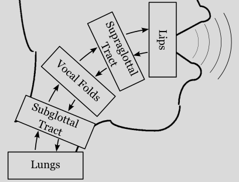

# pyLeTalker - Wave-reflection voice synthesis framework

[](https://pypi.org/project/pyLeTalker/)


<!-- [](https://mybinder.org/v2/gh/YannickJadoul/Parselmouth/master?urlpath=lab%2Ftree%2Fdocs%2Fexamples) -->

`pyLeTalker` is a Python library to synthesize voice for research use, specifically enabling pathologial voice. (It is not suitable to synthesize speech.) This library started as a repackaged version of [LeTalker, a Matlab GUI demo by Dr. Brad Story](https://sites.arizona.edu/sapl/research/le-talker/), and since has been evolved as a flexible general voice synthesis library built around the wave-reflection vocal tract model. The wave-reflection vocal tract model treats the vibrating air pressure as propagating waves through the vocal tract. Some portion of an incidental wave reflects when it encounters a change in the cross-sectional area of the vocal tract.

<picture>
  <source media="(prefers-color-scheme: dark)" srcset="./docs_src/images/wave-reflection-model-dark.png">
  
</picture>

The `pyLeTalker` modularize the voice production system into 5 elements: lungs, subglottal tract, vocal folds (glottis), supraglottal tract, and lips. Each subsystem is implemented as a Python class. The library comes with one or more classes for each voice production element. For example, there are two built-in vocal-fold models: `LeTalkerVocalFolds` (self-oscillating 3-mass model with muscle activation inputs) and `KinematicVocalFolds` (3D vocal fold model with preprogrammed oscillation pattern).

The other part of `pyLeTalker` is its `function_generators` subpackage to enable time-varying control of voice production models. Actual voice production is perpetually dynamic. The synthesis models accept both constant parameter values as well as a `FunctionGenerator` object, so that the user can better program the behaviors.

Both synthesis elements and function generators can be customized. Hence, `pyLeTalker` is suitable framework to evaluate new vocal fold models.

## Installation

```
pip install pyLeTalker
```

## Documentation

Visit our [GitHub page here](https://tikuma-lsuhsc.github.io/pyLeTalker).

Be warned that the documentation is still very early in its draft. When in doubt, 
post your questions on [the Discussion board](https://github.com/tikuma-lsuhsc/pyLeTalker/discussions).


## Simple Examples

The following closely reproduces the [LeTalker demo](https://sites.arizona.edu/sapl/research/le-talker/)'s 
default configuration:

```python

import letalker as lt

fs = lt.fs # sampling rate (44.1 kHz)

T = 0.5 # simulation duration
N = round(T*lt.fs) # number of samples to generate

# define the simulation elements using the default parameter values
vf = lt.LeTalkerVocalFolds() # 3-mass vocal fold model with muscle activation
vt = lt.LeTalkerVocalTract('aa') # supraglottal vocal tract to produce /a/
tr = lt.LeTalkerVocalTract('trach') # trachea / subglottal tract
lp = lt.LeTalkerLips() # Ishizaka-Flanagan lip model
lg = lt.LeTalkerLungs() # constant lung pressure 

# run the simulation
pout, res = lt.sim(N, vf, vt, tr, lg, lp) 
# pout - radiated sound pressure signal (a 1D NumPy Array)
# res - a dict of Results objects of all the simulation elements

```

The above script synthesizes an /a/ vowel sustained for 0.5 second of phonating /a/
approximately at $f_o\approx100$ Hz. `lt.sim()` is the basic simulation function,
and it is equipped with the default arguments so the above example can be shortened
to  

```python

# only need to define the vocal folds element
vf = lt.LeTalkerVocalFolds() # 3-mass vocal fold model with muscle activation

# run the simulation with default subglottal tract, lips, and lungs elements as
# well as the supraglottal tract with the specified vowel (/a/ in this case)
pout, res = lt.sim(N, vf, 'aa') 

```

The kinematic vocal fold model (`lt.KinematicVocalFolds`) is a potent vocal fold 
model to provide more predictable outcomes, especially $f_o$, by trading off the
interaction between the glottal flow and glottal area for programmable vocal fold
geometry and motion. 

```python

fo = 100 # fundamental frequency in Hz

# define the simulation elements 
vf = lt.KinematicVocalFolds(fo) # 3-mass vocal fold model with muscle activation

# run the simulation
pout, res = lt.sim(N, vf, 'aa') 

```

The kinematic vocal folds get their own simulation function for convenience:

```python
pout, res = lt.sim_kinematic(N, fo, 'aa') 
```

## Use and Contribution

The development and documentation of pyLeTalker is heavily biased towards the
current research interests of the active developers. This project is offered as 
open-source to attract other voice researchers to get involved even just to use 
the library. 

If you are interested in using pyLeTalker but unsure of how to use 
it, please post your interest on [the Discussion board](https://github.com/tikuma-lsuhsc/pyLeTalker/discussions)
or email me.
I will help you setting up your script. This will help refining the available-but-
not-yet-used features (both debugging and documentation) or adding new features
that are not currently included. 

If you are a Python programmer/researcher and encountered a bug or needing a new 
feature, please post on [the Issues board](https://github.com/tikuma-lsuhsc/pyLeTalker/issues),
and I'll be happy to discuss the prospect. I will accept [pull requests](https://github.com/tikuma-lsuhsc/pyLeTalker/pulls)
but only after reviewing their values and qualities.
